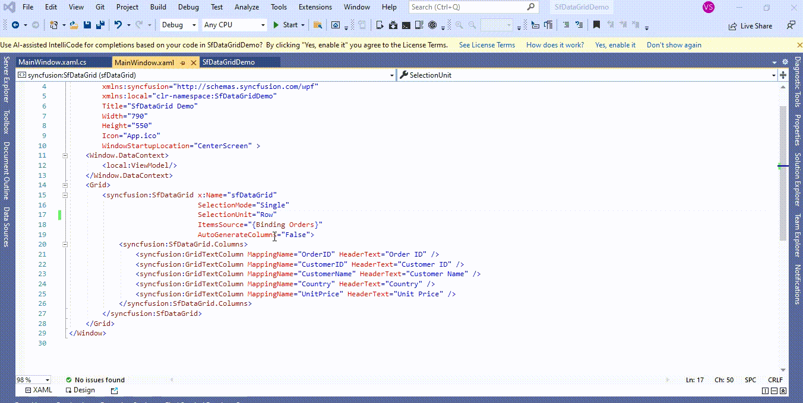

# How to change the PageUp and PageDown key behavior in WPF DataGrid (SfDataGrid)?

## About the sample
This example illustrates how to change the PageUp and PageDown key behavior in [WPF DataGrid](https://www.syncfusion.com/wpf-controls/datagrid) (SfDataGrid)?

[WPF DataGrid](https://www.syncfusion.com/wpf-controls/datagrid) (SfDataGrid) when you press the **PageUp** or **PageDown** key will be scrolled to the previous set of rows or the next set of rows that are not displayed in the view. To change this behavior like **Tab** key navigation that moves the currentcell to next cell of the same row by overriding [GridCellSelectionController](https://help.syncfusion.com/cr/wpf/Syncfusion.UI.Xaml.Grid.GridCellSelectionController.html) / [GridSelectionController](https://help.syncfusion.com/cr/wpf/Syncfusion.UI.Xaml.Grid.GridSelectionController.html) class and setting it to [SfDataGrid.SelectionController](https://help.syncfusion.com/cr/wpf/Syncfusion.UI.Xaml.Grid.SfDataGrid.html#Syncfusion_UI_Xaml_Grid_SfDataGrid_SelectionController) property.

When [SelectionUnit](https://help.syncfusion.com/cr/wpf/Syncfusion.UI.Xaml.Grid.SfDataGrid.html#Syncfusion_UI_Xaml_Grid_SfDataGrid_SelectionUnit) is a [Cell](https://help.syncfusion.com/cr/wpf/Syncfusion.UI.Xaml.Grid.GridSelectionUnit.html), you have to override [GridCellSelectionController](https://help.syncfusion.com/cr/wpf/Syncfusion.UI.Xaml.Grid.GridCellSelectionController.html) and when [SelectionUnit](https://help.syncfusion.com/cr/wpf/Syncfusion.UI.Xaml.Grid.SfDataGrid.html#Syncfusion_UI_Xaml_Grid_SfDataGrid_SelectionUnit) is [Row](https://help.syncfusion.com/cr/wpf/Syncfusion.UI.Xaml.Grid.GridSelectionUnit.html), you have to override [GridSelectionController](https://help.syncfusion.com/cr/wpf/Syncfusion.UI.Xaml.Grid.GridSelectionController.html) class.

[WPF DataGrid](https://www.syncfusion.com/wpf-controls/datagrid) (SfDataGrid) is defined with [SelectionUnit](https://help.syncfusion.com/cr/wpf/Syncfusion.UI.Xaml.Grid.SfDataGrid.html#Syncfusion_UI_Xaml_Grid_SfDataGrid_SelectionUnit) as [Cell](https://help.syncfusion.com/cr/wpf/Syncfusion.UI.Xaml.Grid.GridSelectionUnit.html). You can change the **PageUp** and **PageDown** key behavior by overriding the [ProcessKeyDown](https://help.syncfusion.com/cr/wpf/Syncfusion.UI.Xaml.Grid.GridCellSelectionController.html#Syncfusion_UI_Xaml_Grid_GridCellSelectionController_ProcessKeyDown_System_Windows_Input_KeyEventArgs_) method in [GridCellSelectionController](https://help.syncfusion.com/cr/wpf/Syncfusion.UI.Xaml.Grid.GridCellSelectionController.html) in [WPF DataGrid](https://www.syncfusion.com/wpf-controls/datagrid) (SfDataGrid).

```XML

<syncfusion:SfDataGrid x:Name="sfDataGrid"  
                               SelectionMode="Single"
                               SelectionUnit="Cell"                              
                               ItemsSource="{Binding Orders}"
                               AutoGenerateColumns="False"/>

```

```C#

// set the customized GridCellSelectionControllserExt to SfDataGrid.SelectionController when CellSelection applied in SfDataGrid
this.sfDataGrid.SelectionController = new GridCellSelectionControllerExt(sfDataGrid);


//Inherits the GridCellSelectionController Class
public class GridCellSelectionControllerExt : GridCellSelectionController
{
        public GridCellSelectionControllerExt(SfDataGrid datagrid)
          : base(datagrid)
        {
        }

        //overriding the ProcessKeyDown Event from GridCellSelectionController base class
        protected override void ProcessKeyDown(KeyEventArgs args)
        {
            if (args.Key == Key.PageUp || args.Key == Key.PageDown)
            {
                //Key based Customization 
                KeyEventArgs arguments = new KeyEventArgs(args.KeyboardDevice, args.InputSource, args.Timestamp, Key.Tab) { RoutedEvent = args.RoutedEvent };
                base.ProcessKeyDown(arguments);
                //assigning the state of Tab key Event handling to PageUp and PageDown key
                args.Handled = arguments.Handled;
                return;
            }
            base.ProcessKeyDown(args);
        }
}

```


[WPF DataGrid](https://www.syncfusion.com/wpf-controls/datagrid) (SfDataGrid) is defined with [SelectionUnit](https://help.syncfusion.com/cr/wpf/Syncfusion.UI.Xaml.Grid.SfDataGrid.html#Syncfusion_UI_Xaml_Grid_SfDataGrid_SelectionUnit) as [Row](https://help.syncfusion.com/cr/wpf/Syncfusion.UI.Xaml.Grid.GridSelectionUnit.html). You can change the **PageUp** and **PageDown** key behavior by overriding the [ProcessKeyDown](https://help.syncfusion.com/cr/wpf/Syncfusion.UI.Xaml.Grid.GridSelectionController.html#Syncfusion_UI_Xaml_Grid_GridSelectionController_ProcessKeyDown_System_Windows_Input_KeyEventArgs_) method in [GridSelectionController](https://help.syncfusion.com/cr/wpf/Syncfusion.UI.Xaml.Grid.GridSelectionController.html) in [WPF DataGrid](https://www.syncfusion.com/wpf-controls/datagrid) (SfDataGrid).

```XML

<syncfusion:SfDataGrid x:Name="sfDataGrid"  
                               SelectionMode="Single"
                               SelectionUnit="Row"                              
                               ItemsSource="{Binding Orders}"
                               AutoGenerateColumns="False">

```

```C#

// set the customized GridSelectionControllserExt to SfDataGrid.SelectionController when RowSelection applied in SfDataGrid
this.sfDataGrid.SelectionController = new GridSelectionControllerExt(sfDataGrid);

//Inherits the GridSelectionController Class
public class GridSelectionControllerExt : GridSelectionController
{
        public GridSelectionControllerExt(SfDataGrid datagrid)
          : base(datagrid)
        {
        }

        //overriding the ProcessKeyDown Event from GridSelectionController base class
        protected override void ProcessKeyDown(KeyEventArgs args)
        {
            if (args.Key == Key.PageUp || args.Key == Key.PageDown)
            {
                //Key based Customization 
                KeyEventArgs arguments = new KeyEventArgs(args.KeyboardDevice, args.InputSource, args.Timestamp, Key.Tab) { RoutedEvent = args.RoutedEvent };
                base.ProcessKeyDown(arguments);
                //assigning the state of Tab key Event handling to PageUp and PageDown key
                args.Handled = arguments.Handled;
                return;
            }
            base.ProcessKeyDown(args);
        }
}

```



Take a moment to peruse the [WPF DataGrid – Selection](https://help.syncfusion.com/wpf/datagrid/selection) documentation, where you can find about selection with code examples.

Please refer this [link](https://www.syncfusion.com/wpf-controls/datagrid) to know about the essential features of WPF DataGrid.

## Requirements to run the demo
Visual Studio 2015 and above versions
